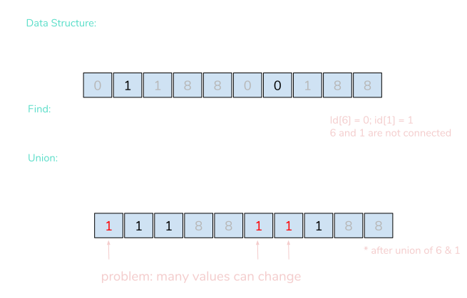
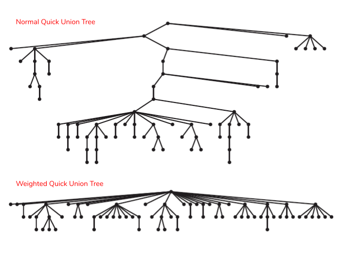
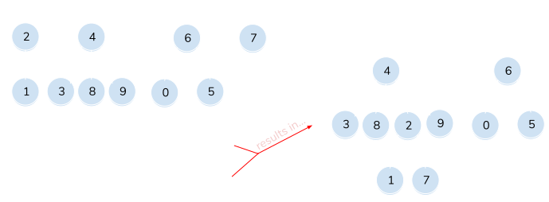
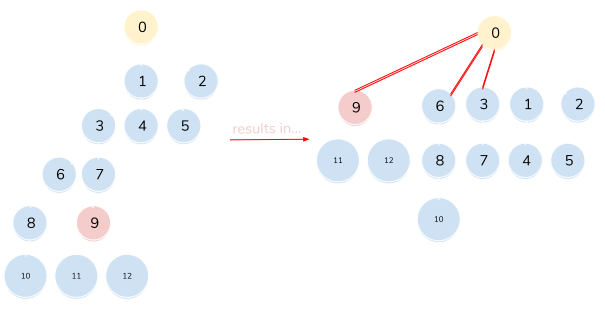

> _Note: This post is part of the Data Structures and Algorithm series. To see more posts from this series, [click here](/series/data-structures-and-algorithms). The illustrations below are inspired by the Algorithms, Part I course on [Coursera](https://www.coursera.org/learn/algorithms-part1). All code examples from this series can be found [here](https://github.com/thefrugaldev/data-structures-and-algorithms)._

A [**_disjoint-set_**](https://en.wikipedia.org/wiki/Disjoint-set_data_structure) (also referred to as a _union-find_ data structure) is a data structure that tracks a set of elements partitioned into a group of disjoint subsets (also known as [_connected components_](<https://en.wikipedia.org/wiki/Component_(graph_theory)>)). Given this type of data structure, there are multiple algorithms that can be used to solve the two major equations for a disjoint-set, the **_Union_** command and the **_Find_** query, which we'll go into more detail below.


## **Dynamic Connectivity**

- A dynamic connectivity structure maintains information about the connected components of a graph.
- Given a set of _N_ objects:
  - Connect two objects (the **_Union_** command)
  - Determine if there is a path connecting the two objects (the **_Find_** query)

### Union-Find Illustration


## **Quick Find**

- Quick Find is an [_Eager_ algorithm](https://en.wikipedia.org/wiki/Eager_evaluation) also used to solve the _dynamic connectivity_ problem.
- The **_Find_** query for this algorithm is very efficient and is measured in [constant time](https://en.wikipedia.org/wiki/Time_complexity#Constant_time).
  - Given id[] of size _N_, check if _p_ and _q_ are connected.
- The **_Union_** command is measured in quadratic time because the time to resolve is dependent on the size of the array and the number of values that must change as a result.
  - When changing a value of `id[q]`, you must also change all entries whose value is equal (connected) to `id[q]` as well.

### Quick Find Illustration



### Quick Find Implementation

```typescript
import DisjointSet from "./DisjointSet"

class QuickFind implements DisjointSet {
  disjointSet: number[]

  constructor(quantity: number) {
    this.disjointSet = []

    for (let i = 0; i < quantity; i++) this.disjointSet[i] = i
  }

  connected = (p: number, q: number): boolean => {
    return this.disjointSet[p] === q
  }

  union = (p: number, q: number): void => {
    const pid = this.disjointSet[p]
    const qid = this.disjointSet[q]

    this.disjointSet.forEach((value, index) => {
      if (value === pid) {
        this.disjointSet[index] = qid
      }
    })
  }
}

export default QuickFind
```

## **Quick Union**

- Quick Union is a [_Lazy_ algorithm](https://en.wikipedia.org/wiki/Lazy_evaluation) that, again, is used to solve the _dynamic connectivity_ problem.
- Data structures implementing this algorithm are represented as [trees](<https://en.wikipedia.org/wiki/Tree_(graph_theory)>) in order to find the connected root of each element.
- The **_Find_** query requires a traversal up the tree:
  - Given id[] of size _N_, check if _p_ and _q_ have the same _root_.
- The **_Union_** command requires the _find_ query in order to determine each element's root before merging.
  - This command is measured in [linear time](https://en.wikipedia.org/wiki/Time_complexity#Linear_time) because in order to merge the _connected components_ containing _p_ and _q_, we must set the id of _p_'s root to the id of _q_'s root.

### Quick Union Illustration


### Quick Union Implementation

```typescript
import DisjointSet from "./DisjointSet"

class QuickUnion implements DisjointSet {
  disjointSet: number[]

  constructor(quantity: number) {
    this.disjointSet = []

    for (let i = 0; i < quantity; i++) this.disjointSet[i] = i
  }

  private root(valueToCheck: number): number {
    while (this.disjointSet[valueToCheck] !== valueToCheck) {
      valueToCheck = this.disjointSet[valueToCheck]
    }

    return valueToCheck
  }

  private isDirectChild(p: number, q: number): boolean {
    return this.disjointSet[p] === q
  }

  connected(p: number, q: number): boolean {
    if (this.isDirectChild(p, q)) return true

    return this.root(p) === this.root(q)
  }

  union(p: number, q: number): void {
    const rootP = this.root(p)
    const rootQ = this.root(q)

    this.disjointSet[rootP] = rootQ
  }
}

export default QuickUnion
```

## Improvements to Quick Union

## Weighted Quick Union

- We can improve Quick Union by _"weighting"_ our algorithm. What this means is that anytime a **_Union_** operation is performed, we will always link the root of the smaller tree to the root of the larger tree.
  - This helps to keep the overall tree structure relatively flat, compared to a normal quick-union tree (as pictured below), and ensures each node is never too far from the overall root node.
  - The **_Find_** query takes the time proportional to the depth of _p_ and _q_.
    - Because we are always setting the root of the smaller tree to that of the larger tree, the depth of any node is **_at most_** _log N_ (where N is the number of nodes in the overall tree).



### Weighted Quick Union Illustration



### Weighted Quick Union Implementation

For the weighted quick union implementation, you can see below that our **_Find_** query remains the same. For the **_Union_** operation, however, we are incrementing the size of the larger root by the size of the smaller root.

```typescript
import DisjointSet from "./DisjointSet"

class WeightedQuickUnion implements DisjointSet {
  disjointSet: number[]
  size: number[]

  constructor(quantity: number) {
    this.disjointSet = []
    this.size = []

    for (let i = 0; i < quantity; i++) {
      this.disjointSet[i] = i
      this.size[i] = 1
    }
  }

  private root(valueToCheck: number): number {
    while (this.disjointSet[valueToCheck] !== valueToCheck) {
      valueToCheck = this.disjointSet[valueToCheck]
    }

    return valueToCheck
  }

  private isDirectChild(p: number, q: number): boolean {
    return this.disjointSet[p] === this.disjointSet[q]
  }

  connected(p: number, q: number): boolean {
    if (this.isDirectChild(p, q)) return true

    return this.root(p) === this.root(q)
  }

  union(p: number, q: number): void {
    const rootP = this.root(p)
    const rootQ = this.root(q)

    if (rootP === rootQ) return

    if (this.size[rootP] <= this.size[rootQ]) {
      this.disjointSet[rootP] = rootQ
      this.size[rootQ] += this.size[rootP]
    } else {
      this.disjointSet[rootQ] = rootP
      this.size[rootP] += this.size[rootQ]
    }
  }
}

export default WeightedQuickUnion
```

## Weighted Quick Union with Path Compression

- This algorithm can be improved even further by compressing the path to the overall root.
  - So, after computing the root of _p_, for any node that was passed over (6, 3, 1 in the following illustration), we'll set it to point to the new root as well.
  - This causes our overall tree to flatten even further, decreasing the time complexity to _almost_ linear.

### Weighted Quick Union with Path Compression Illustration



### Weighted QU with Path Compression Implementation

For this implementation, we're going to update our `root` method so that for each traversal to an object's root, we'll set the value of every other node in the path to point to its grandparent, thereby halving the length to the object's root.

```typescript
private root(valueToCheck: number): number {
  while (this.disjointSet[valueToCheck] !== valueToCheck) {
    this.disjointSet[valueToCheck] = this.disjointSet[
      this.disjointSet[valueToCheck]
    ];
    valueToCheck = this.disjointSet[valueToCheck];
  }

  return valueToCheck;
}
```
