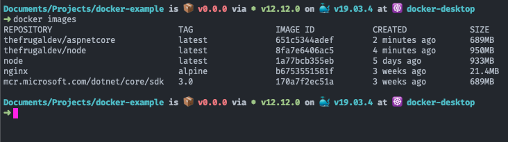

I recently began playing around with Docker in my spare time. I've heard a lot about the benefits of containerizing applications but, being an avid practitioner of [pain driven development](https://www.weeklydevtips.com/episodes/010), I haven't found the need to implement it in any of my applications thus far. Curiosity got the better of me, however, and I decided to list out a quick reference guide for common commands used within the Docker CLI. A [complete list of these commands](https://docs.docker.com/engine/reference/commandline/cli/) are readily available on Docker's documentation site, but feel free to follow along in your terminal after [downloading Docker Desktop](https://hub.docker.com/?overlay=onboarding).

## Getting Started

The easiest way to get started from the command line, and typically one of the first commands I run when starting out with a new CLI, is the **_help_** command. The `docker help` command will give you a list of commands that are available within the Docker CLI.

## Images

In Docker, an _image_ is a set of instructions or commands used to create a _container_ (more on containers later). Images are immutable in nature, so once an image is built, it must either be re-created or deleted using a new set of instructions. The instructions that Docker images are built from are known as [Dockerfiles](https://docs.docker.com/engine/reference/builder/).

In order to build an image, a [simple command](https://docs.docker.com/engine/reference/commandline/build/) can be run from your terminal:

```bash
docker build -f {DOCKER_FILE_NAME} -t {IMAGE_TAG} .
```

`docker build` is executed with a couple of arguments to build a Docker _image_. The first argument specifies which Dockerfile to reference in order to build the image, and the second argument specifies the tag, or alias, of the image that you are building. So, the above command could look something like this:

```bash
docker build -f node.dockerfile -t thefrugaldev/node .
```

Once you've got a few images created, you can list them out using the [following command](https://docs.docker.com/engine/reference/commandline/images/):

```bash
docker images
```

This will list out all top level images, including their properties such as tags, the date they were created, size, and their image id. The output in your terminal should look something like this, after execution.



If you find that you have too many images or decide you don't need a specific image anymore, you can always remove an image by providing the image id as an argument to the [following command](https://docs.docker.com/engine/reference/commandline/rmi/).

```bash
docker rmi {IMAGE ID}
```

## Containers

Containers are probably what brought you to Docker in the first place. The word gets thrown around a lot when mentioning Docker, but what is a container? From a high level, a container is similar to an image, but its state can change and is built at runtime. Containers, unlike images, have a writable persistence layer, that can be added to or modified. When a container is deleted, so too is this persistence layer. So, in this sense, multiple containers can share a single image, and still have an isolated persistence layer.

To [run a container](https://docs.docker.com/engine/reference/commandline/run), simply specify which image you want to run. The terminal will then return the container id of the newly created container.

```bash
docker run -d thefrugaldev/node
```

There are quite a few [options](https://docs.docker.com/engine/reference/commandline/run/#options) that you can pass to the previous command:

```bash
docker run -d --net {NETWORK} --name {CONTAINER_ALIAS} -p {LOCAL_PORT:HOST_PORT} {IMAGE_TO_RUN}
```

By specifying `-d` you are telling Docker to run in detach, or background, mode. In Docker, you can set up an isolated network with the `--net` argument, and containers within that network can communicate with one another. The `--name` allows you to assign a name to the container, making it easier to maintain after it's up and running. The `-p` flag allows you to bind an external port on your local machine to an internal port on the host machine that is running the container. Finally, you can provide the image you'd like to run. An example of this command might look something like this.

```bash
docker run -d --net isolated_network --name my_funky_new_container -p 8080:5000 thefrugaldev/aspnetcore
```

Sometimes, you may need to [execute an external command](https://docs.docker.com/engine/reference/commandline/exec/) once an application is up and running. For this, Docker allows the `exec` command to be run within the context of a specific container.

```bash
docker exec {CONTAINER_NAME} {CMD}
```

Once you've got a few containers up and running, feel free to run any of the following commands to [visualize](https://docs.docker.com/engine/reference/commandline/ps/) and [remove](https://docs.docker.com/engine/reference/commandline/rm/) any containers running on your machine.

```bash
docker ps # list any running containers
docker ps -a # list all containers (running or otherwise)
docker rm {CONTAINER_ID} # remove a specific container by id
docker rm -f $(docker ps -a -q)
```

That final command is an interesting one. It's forcing docker to remove containers with the `-f` flag. The last part of that command `$()` tells Docker to evaluate an expression inside the parentheses. Here, we're telling Docker to find all containers (running or otherwise) in quiet (`-q`) mode (only display numeric IDs) and return what was found. The entirety of the command essentially tells Docker to remove all containers (running or otherwise).

## Volumes

For larger write operations, containers can have _volumes_ associated with them as well. You can think of volumes like a symlink that points to a virtual directory that is managed by Docker. When you stop, or even remove, a container, the volume remains in-tact unless you explicitly remove it. This allows volumes to be safely shared by multiple containers.

In order to remove a container, along with any associated volumes, you'll want to [use the following command](https://docs.docker.com/engine/reference/commandline/rm/) (which you've seen before) with the specified `-v` option.

```bash
docker rm -v {CONTAINER_ID}
```

If you happen to remove a container and forget to remove its associated volumes (which never happens to me :wink:), there is a [quick and easy command](https://docs.docker.com/engine/reference/commandline/volume_prune/) to remove any unused volumes that may be stuck out in purgatory.

```bash
docker volume prune
```

## Docker Compose

Once you get comfortable with Docker, you may find creating multiple containers from individual images can become tedious and is not very scalable. If that's the case, take a look at [Docker Compose](https://docs.docker.com/compose/). According to their docs, compose is a _"tool for defining and running multi-container Docker applications"_. To take advantage of _docker-compose_, you'll need to create a [yaml](https://yaml.org/) file that informs Docker of instructions necessary to create containers, including the docker file to use, networks to create, ports to use, etc.

I wont go into too much detail around the [docker-compose cli](https://docs.docker.com/compose/reference/overview/), but I've provided a list of common commands that I think will be beneficial on your journey.

```bash
docker-compose build
# build the images specified in the docker-compose.yml file
docker-compose up -d
# builds, (re)creates, starts, and attaches to containers for a service
# the -d flag tells docker-compose to run in detach mode
docker-compose down --rmi all --volumes
# stops and removes containers
# also removes any networks, volumes and images created by the up command
docker-compose logs
# displays log outputs.
# very useful if you run the up command in detach mode
docker-compose ps
# list all currently running containers
docker-compose start
# starts existing containers
docker-compose stop
# stop running containers without removing them
docker-compose rm -v
# removes any stopped containers
# the -v flag also removes any attached volumes
```

## Extensions

I hope the above commands can serve as a reference point for others as I'm sure it will for me when I inevitably forget them. As a side note, I wanted to end this post by suggesting a very helpful extension for Visual Studio Code. If you haven't already, I suggest downloading the [Docker extension](https://marketplace.visualstudio.com/items?itemName=ms-azuretools.vscode-docker) provided by Microsoft. This extension gives you a GUI to really help visualize what containers, volumes, images, and registries are currently enabled on your local machine.
