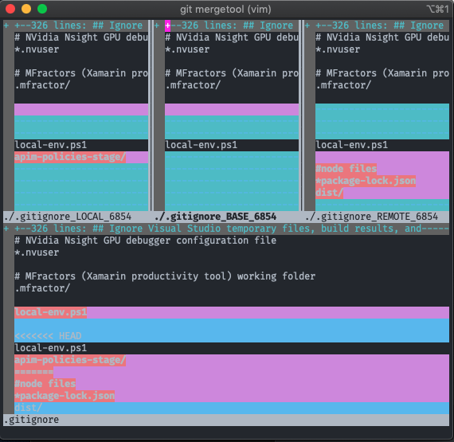

There are quite a few ways to resolve conflicts in git, whether it's through the command-line or a GUI. In this post, I'm going to offer an opinionated solution using the command-line and, more specifically, using a tool called vimdiff (because I'm most familiar with the Vim interface).

## Set up Git config with your tool of choice

The first thing you'll want to do is configure git to use the [mergetool](https://git-scm.com/docs/git-mergetool) you're most comfortable with. There are a number of options to choose from, including emerge, gvimdiff, kdiff3, meld, vimdiff, and tortoisemerge. For a complete list of tools and settings, simply run `git mergetool --tool-help` in your terminal. In this post, I'm going to use vimdiff. Now, I could do this by running `git -t vimdiff`, which would configure it as my tool for this session only. However, I want git to always default to this tool for any future conflicts.

So, the first few commands that we'll run are:

```bash
git config merge.tool vimdiff
git config merge.conflictstyle diff3
git config mergetool.prompt false
```

The first command specifies which tool is used by the git-mergetool. The second command specifies the formatting of conflicts in your terminal. Setting "diff3" in this instance adds the original text to the conflict display, but leaving it as default and omitting the second command is fine as well. Finally, the last command just ensures that the user is prompted before the merge resolution is executed.

## Starting the merge tool

Executing the `git mergetool` command will run the mergetool and you can begin resolving conflicts.

Your terminal should now display an interface similar to the format in the image below.


As you can see, there are four sections in this UI. The **_local_** section is the file from the current local branch. The **_base_** is the common ancestor between the local and remote commits. This is essentially what the file looked like before either commit was changed. The **_remote_** file is the one you are merging into your branch. Lastly, the **_merged_** file at the bottom is the result of the conflict resolution and what will be saved in your repository after you execute the resolution.

You can navigate between the four areas of the terminal using `Ctrl W` to move between windows, or `Ctrl W` + `J` to move directly to the **_merged_** window. For other navigational commands, [visit the vim docs](http://vimdoc.sourceforge.net/htmldoc/windows.html#window-moving).

## Edit the files

Once you've navigated to the window that you want to edit, press the `i` key to insert text in Vim. After you're finished making the changes you'd like, press the `esc` key to exit **_insert mode_** and enter **_command mode_**, and you should see those changes reflected in your **_merged_** section. If not, simply type `:diffupdate` and hit enter and the UI should update to show your merged copy.

If this seems tedious and you would rather take a complete copy of either the **_local_**, **_base_**, or **_remote_** files, you can run the following commands. `:diffg RE` gets the entire changes from the **_remote_** copy, `:diffg BA` from the **_base_** copy, and `:diffg LO` from **_local_**.

## Save your changes

After you're satisfied with the changes you made, and the merged copy reflects what you were after, it's time to save and commit the changes.

Enter **_command mode_** by pressing `esc`, and type `:wqa`. This command will write, save, and quite all files within Vim. You are now ready to commit your changes using the well-known `git commit -m "My Commit Message"` command. Vimdiff will create a few files for you during the resolution, most ending in a `*.orig` suffix, but to get rid of these files simply run `git clean`.

## All finished

That should do it. Assuming you had no other conflicts, you should now be ready to push your changes. If there are more, feel free to use the same process we just went over to resolve any outstanding conflicts. I originally decided to write this article as a reference guide for myself, but I hope I've helped a few other frustrated devs stuck in conflict purgatory along the way :wink:.
