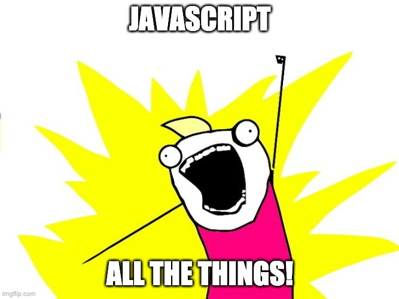
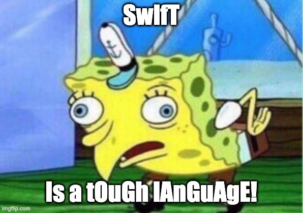

## Introduction

If you're like me, mobile development can seem intimidating. I was used to this world where JavaScript was the hammer that solved all problems when it came to web development. There are solutions to mobile development in the JavaScript ecosystem (like [React Native](https://reactnative.dev/)) that helped bridge that gap a bit, but I still felt this desire to really understand what was happening behind the curtain. In order to kickstart this journey into mobile development, I began in the most obvious starting place, learning [Swift](https://developer.apple.com/swift/). Swift is the official language created by Apple to develop applications for iOS, macOS, watchOS and tvOS. In this introduction to Swift, I'll explore different concepts and try explaining how they relate to their counterparts (if one exists) in JavaScript. Let's get started!



## The Basics

**Var** - similar to the `var` and `let` keyword in JS. Used to initialize scoped variables.

**Let** - analogous to `const` in JS. Once it's declared, it cannot be mutated. Small subtlety here in that it can be initialized without an initial value, and eventually set later, but still may only be set **_once_**.

**Optionals** - If you're familiar with TypeScript, these are very similar to nullable values. You declare an optional by appending a `?` at the end of the data type declaration. It's essentially telling Swift, _"this property may or may not have a value associated with it"_. If it does not, the value is set to `nil` and no compilation errors are thrown. Any data type in Swift can be set as an optional.

- _Side note:_ In order to retrieve a value from an optional, you must **_unwrap_** it in Swift. There are two methods to unwrapping an optional, a _forced_ unwrap where Swift pulls the value out without checking for its existence (the onus is on you to check this). The other, more streamlined, approach is to store it in a temp variable if a value exists, or keep moving along if it doesn't. Both options are shown below:

```Swift
// declare your optional
var optionalString: String?

// shorter, more concise approach
if let unwrappedString = optionalString {
    print(unwrappedString)
} else {
    //...no value, do something else
}

// must check for value here or app could crash
if optionalString != nil {
    // we are force unwrapping here by using the bang (!) operator
    var unwrappedString = optionalString!
    print(unwrappedString)
}
```

## Data Types

All of your typical primitive data types (`bool`, `char`, `int`, `float`, etc) are available in Swift, as well as some of your other common types found in JavaScript (`string`, `array`). There are even a few others you might not be familiar with if you're coming from a pure JavaScript background (`dictionary`, `set`, `enum`). If you're used to TypeScript, the syntax for declaring these data types may look familiar:

```Swift
var myString: String
var myInt: Int
var myIntArray: [Int] // Array of Int
var students: [Int: String] // Dictionary of Int keys and String values
enum animalEnum {
    case lion
    case tiger
    case bear
}
```

With the string data type also comes string interpolation, which does exist in Swift but the syntax may look a bit different than what you're used to:

```Swift
let firstName = "Foo"
let lastName = "Barr"
let age = 30

//string interpolation
print("Hello, my name is \(firstName) \(lastName), and I'm \(age) years old!")
```

## Functions

Functions are structured in a similar way to what you might be used to, with a few minor differences thrown in. Functions are declared with the `func` keyword. Any parameters must identify their data type, and any calling function must explicitly define the arguments it's passing to the function (there are times when this restriction isn't true, but for the sake of this article, I'll stick with the rule of thumb here).

```Swift
func printHappyBirthdayMessage(age: Int, name: String) {
    print("Happy birthday, \(name)! I can't believe you're already \(age) years old!)
}

printHappyBirthdayMessage(age: 30, name: "Foo Bar")
```

If you are returning a value, you must specify its data type as well, using the arrow syntax (this may look familiar to arrow functions in JavaScript, except with a single dashed arrow instead of `=>`):

```Swift
func calculateSqFeet(length: Int, width: Int) -> Int {
    return length * width
}
```

## Loops

There are three major types of loops in Swift, and are all pretty common in JavaScript: `while`, `repeat-while` (analogous to `do-while` in JavaScript), and `for-in` loops. The main one that you'll find yourself using is the `for-in` and its syntax is pretty much the same as JavaScript.

In Swift, there are some additional utilities you can use with loops as well, including `range` operator to increment by 1:

```Swift
for number in 0...10 {
    print(number) // this will print out all numbers 0 to 10, including 10
}

for number in 0..<10 {
    print(number) // this will print out all numbers 0 to 9
}
```

Decrementing is just as easy. There are also going to be times where incrementing one by one is not sufficient. In Swift, using `strides` make both of these situations a breeze:

```Swift
for number in stride(from: 0, through: 256, by: 16) {
    print(number) // this will print out all numbers 0 to 256, including 256, and increment by 16 at a time
}

for number in stride(from: 0, to: 256, by: 16) {
    print(number) // this will print out all numbers 0 to and increment by 16 at a time
}

for number in stride(from: 100, through: 0, by: -10) {
    print(number) // this will print out all numbers 100 to 0, including 0, and decrement by 10 at a time
}
```

## Structs and Classes

Structs are very similar to classes in that they group related pieces of information into one body or object. A few differences between the two are that structs cannot implement inheritance and are considered value types, whereas classes are considered reference types in Swift.

Structs also support initializers that get called anytime a new struct is instantiated, but they are **_not required_**. The difference here is that classes do require initializers (think constructors in other languages) if default values are not provided. Classes also allow for `de-initializers` that are used to cleanup after a class reference is removed from memory by the ARC (Automatic Reference Counting), otherwise known as the garbage collector in other languages. Both classes and structs can contain _protocols_ (discussed a bit later in this article) and [_subscripts_](https://docs.swift.org/swift-book/LanguageGuide/Subscripts.html) as well.

```Swift
struct Book {
    // static properties
    var title: String
    var author: String
    var genre: String
    var publishYear: Int
    var currentPage: Int
    var totalPages: Int

    //computed property - also available in classes
    var remainingPages: Int {
        // excluding a setter makes it a readonly computed prop
        get {
            return totalPages - currentPage
        }
    }

    // methods
    func overview() -> String {
        return "\(title) is a \(genre) book, written by \(author) in \(publishYear)"
    }
}

var newBook = Book(title: "1984", author: "George Orwell", genre: "Fantasy", publishYear: 1949)

print(newBook.overview()) // "1984 is a Fantasy book, written by George Orwell in 1949"
```

```Swift
class Animal {
    var numberOfLegs: Int
    init() {
        self.numberOfLegs = 2
    }

    final func walk() { // using the final keyword ensures this function can't be overwritten
        // ...walk function logic
    }

    deinit {
        // do any cleanup work here
    }
}

class Dog : Animal {
    override init() { // must use the override keyword here
        super.init() // have to call superclass' init method first
        super.numberOfLegs = 4 // to override a property
    }

    func bark () {
        print("woof woof")
    }
}


let myDog = Dog()
print(myDog.numberOfLegs) // prints out 4
```

## Closures

Closures in Swift are blocks of code that you intend to pass to a function or method. You can think of this as an anonymous function you might pass to another function in JavaScript. There are a few ways to write and pass closures and the following three solutions are all valid syntax for declaring closures:

```Swift
struct Product {
    var id: Int
    var name: String
    var seller: String
    var price: Float
}

let product1 = Product(id: 1, name: "Book", seller: "Foo Industries", price: 12.00)
let product2 = Product(id: 2, name: "Movie", seller: "Foo Industries", price: 15.00)
let product3 = Product(id: 3, name: "Furniture", seller: "Bar Industries", price: 25.50)

let allProducts = [product1, product2, product3]

func sortByPrice(firstProduct: Product, secondProduct: Product) -> Bool {
    if firstProduct.price <= secondProduct.price {
        return true
    } else {
        return false
    }
}

// Closure examples

// 1) just pass in the defined function above
let priceSortedProducts = allProducts.sorted(by: sortByPrice)

// 2) using the "in" keyword
let nameSortedProducts = allProducts.sorted(by: {
    (firstProduct: Product, secondProduct: Product) -> Bool
    in
    if firstProduct.name <= secondProduct.name {
        return true
    } else {
        return false
    }
})

// 3) using the reserved $index Swift provides
let sellerSortedProducts = allProducts.sorted { $0.seller <= $1.seller }
sellerSortedProducts
```

As you can see in the last example, you can condense your closure down and even remove the `return` statement if it fits on one line of code.

## Extensions

A lot of times, you'll want to extend some behavior that might make it easier to reuse across your application. Swift makes it very easy to extend almost any object, struct, or class by using the `extension` keyword. For example, if I wanted to add some functionality to the native `String` type, I could add the following extension method:

```Swift
extension String {
    func makeSpongebobCase() -> String {
        var newString = ""

        for (index, char) in self.enumerated() {
            let newChar = index % 2 == 0 ? char.uppercased() : char.lowercased()

            newString.append(newChar)
        }

        return newString
    }
}

let text = "Swift is a tough language!"

print(text.makeSpongebobCase()) // SwIfT Is a tOuGh lAnGuAgE!
```



## Protocols

A _protocol_ in Swift is a way to formalize a class or struct's properties and behavior. The easiest way to visualize a protocol is to think of it as a manuscript or list of requirements necessary to implement some behavior or code (in other languages this could be described as an _interface_).

Implementing a protocol is simple, but there a few things to note. If you need to inherit a super class, it **_must_** be defined first. Then you can begin pulling in any necessary protocols. Unlike classes, you can adopt multiple protocols in Swift by separating each one with a comma:

`class MySubClass: MySuperClass, SomeProtocol, SecondProtocol { }`

Defining a protocol is as simple as listing any required properties and methods needed to implement said protocol:

```Swift
protocol DogProtocol {
    // what methods are required?
    func bark()
    func eat()
    func drink()

    // what properties/data types are required?
    var name: String { get set }
    var breed: String { get }
    var age: Int { get set }
}
```

## Some caveats to consider

I hope all of the above helped to give a good introduction into Swift, especially if you're coming from a more web-based language like JavaScript. Outside of the foundational programming concepts, there are a few minor components to be aware of when making your way over to the Swift programming language:

- Parentheses are not required in `if` statements, but are allowed. The opening and closing brackets (`{}`) _are_ required, however.
- Semi-colons are also not required to end a line of code.
- Switch statements do not _flow through_, meaning a `break` keyword is not needed as an exit condition in a case block. Once a matching case has been found, the switch statement exits after the case block executes.
  - Multiple case conditions can be checked at once, using comma delimited values:
  ```Swift
  switch (myValue) {
      // checking multiple cases
      case 1, 2, 3:
          print("case met")
      case 4:
          //do something else
  }
  ```
- If a function has the possibility of throwing an error, the `throws` keyword must be explicitly stated in the function definition, for example:
  - `func makeNetworkCall(url: String) throws -> Int`
- When calling a function that may throw an error, a `do-catch` block might be necessary (similar to a `try-catch` block in other languages).
  - For example, calling the function above might look something like:
  ```Swift
  do {
      result = try makeNetworkCall("www.example.com")
  } catch {
      // ...handle error here
  }
  ```
  - If you don't care about catching the error, you can shorten the above code even more using an optional:
  ```Swift
  if let result = try? makeNetworkCall("www.example.com") {
      print(result)
  }
  ```
- A good alternative to writing a bunch of `if/else` conditions in a function that has a number of optional parameters is using the `guard` clause. Any `guard` must have an `else` block that contains an exit condition if the `guard` evaluates to false:

```Swift
    func myOptionalFunction(param1: String?, param2: Int?, param 3: String?) {
        guard let p1 = param1,
            let p2 = param2,
            let p3 = param3 else {
            // ...return/throw/break/continue statement
        }

        // p1, p2, and p3 all accessible here since guard clause was used
    }
```

- One final keyword to take note of is `defer`. If you find yourself needing to close a connection, or dispose of an object in multiple places, this is a crucial keyword to take advantage of. In Swift, `defer` will ensure that a block of code runs before exiting the calling block of code (whether thats through a return statement, throwing an error, etc). Defining a `defer` block is simple:

```Swift
func processRequest() {
    openConnection()

    defer {
        // something that needs to happen at the end of this function,
        // regardless of what happens during the call of the function
        closeConnection()
    }
}
```
